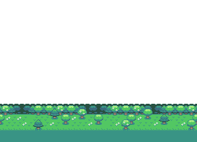

# DOCUMENTAÇÃO DO JOGO

## Nome Do Jogo:
## "FINAL FANTASY"

---

## 1. INTRODUÇÃO

O projeto foi realizado com a finalidade de desenvolver um jogo de plataforma 2D dinâmico e divertido, trazendo da nostalgia para a jogabilidade. Este documento descreve os processos e elementos do jogo, desenvolvido na plataforma de código aberto, Godot.

---

## 2. INFORMAÇÕES DO JOGO

- _NOME DO JOGO_: Final Fantasy
- _PLATAFORMA_: Godot Engine (versão recomendada: 4.0 ou superior)

### PRÉ-REQUISITOS:

- _Godot Engine_: [Baixar](https://godotengine.org/download)
- _Sistema Operacional_: Windows, MacOS ou Linux.

---

## 3. DESCRIÇÃO

Este é um jogo de plataforma no qual o jogador controla um personagem que precisa avançar pelos obstáculos, pulando entre plataformas e evitando cair. O objetivo é chegar ao final da fase, superando os desafios. Inspirado nos clássicos jogos de plataforma, o jogador deve ter agilidade para finalizar cada nível.

---

## 4. COMO JOGAR

- _Movimento_: Use as teclas "W", "A", "S" e "D" para movimentar o personagem.
- _Pular_: Pressione a tecla "Espaço" para pular.
- _Objetivo_: Não cair! O objetivo é chegar ao final da fase evitando os obstáculos e saltando de plataforma em plataforma.

---

## 5. INSTALAÇÃO

Para rodar o jogo, siga os seguintes passos:

1. Clone o repositório do jogo:
   bash
   git clone https://github.com/grleitao/final-fantasy-godot.git
2. Abra o Godot Engine e selecione a opção _"Abrir Projeto"_.
3. Navegue até a pasta onde o repositório foi clonado e abra o projeto.
4. Execute o projeto dentro do Godot para começar a jogar.

---

## 6. ELEMENTOS GRÁFICOS

1. 
2. 
3. 
4. 
5. 
6.  
7.

## 7. PERSONAGEM

---

